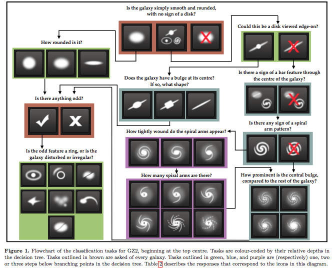
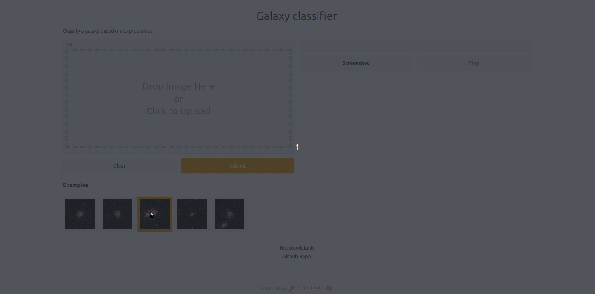

# Galaxy Classification

The model is trained using PyTorch, and then converted to ONNX format for deployment using Heroku.

## Dataset 📂
Dataset used for training is from Kaggle [Galaxy zoo](https://www.kaggle.com/c/galaxy-zoo-the-galaxy-challenge/data) which contains over 140,000 images of various galaxies. Galaxy Zoo is a crowdsourcing project, where users are asked to describe the morphology of galaxies based on images. They are asked questions such as “How rounded is the galaxy” and “Does it have a central bulge”, and the users’ answers determine which question will be asked next. The questions form a decision tree which is shown in the figure below,  

## Notebook 📒
View the notebook here: [galaxyclassification.ipynb](https://nbviewer.org/github/kingjuno/Galaxy-Classification/blob/master/notebook/galaxy_zoo_checkpoint.ipynb)

## Deployment 🚀
The model has been been converted to ONNX format and deployed using Gradio & hosted on Heroku: [Galaxy Classification](https://galaxyclassification.herokuapp.com/)

## Predictions 🔍
Predictions on test data:
